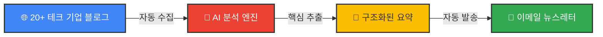

<div align="center">

# 🚀 AI 기반 기술 블로그 뉴스레터 자동화 시스템

### 매일 아침, 커피 한 잔과 함께 받아보는 글로벌 테크 기업의 핵심 인사이트


[🎯 데모 보기](https://ghostflare76.github.io/engineering-rss/newsletters/5jyi6dhHiLQu3BVMVGKrVG) 

</div>

---

## 📌 왜 이 프로젝트가 필요한가?

<table>
<tr>
<td width="50%">

### 😰 Before

- 📚 **정보 과부하**: 수십 개의 기술 블로그, 어디서부터 읽어야 할지 막막함
- ⏰ **시간 부족**: 영문 아티클을 읽고 핵심을 파악하는데 너무 많은 시간 소요
- 🌊 **놓치는 트렌드**: 중요한 기술 동향과 인사이트를 놓치는 악순환
- 🗣️ **언어 장벽**: 영어 압박으로 인한 피로도 증가

</td>
<td width="50%">

### ✨ After

- 🎯 **AI 필터링**: 20개 이상의 주요 테크 기업 블로그를 AI가 자동으로 수집 & 분석
- ⚡ **5분 완독**: 핵심만 쏙쏙 뽑아낸 요약으로 출근길에 가볍게 읽기
- 📬 **자동 배송**: 매일 아침 이메일로 받아보는 큐레이션된 인사이트
- 🎨 **시각적 구분**: 기업별 CI 색상으로 한눈에 파악

</td>
</tr>
</table>

---

## 🎯 핵심 가치

<div align="center">



</div>

### 💡 이 시스템이 답해주는 4가지 질문

| 질문 | 설명 |
|------|------|
| **🔍 이 기술은 뭐야?** | 기술의 본질과 핵심 개념을 명쾌하게 정리 |
| **🤔 왜 썼어?** | 기술 도입 배경과 해결하려는 문제 분석 |
| **📊 그래서 결과는?** | 실제 성과와 개선 지표를 한눈에 |
| **🎓 개발자로서 뭘 챙겨야 해?** | 실무에 바로 적용 가능한 인사이트와 시사점 |

---

## 🏢 수집 대상 테크 기업

<div align="center">

| 기업 | 카테고리 | CI 색상 |
|:----:|:--------:|:-------:|
| 🔵 **Google** | Cloud, AI, Infrastructure | `#4285F4` |
| 🔷 **Meta** | Social, AI, AR/VR | `#0668E1` |
| 🟠 **AWS** | Cloud, Serverless | `#FF9900` |
| 🟡 **Cloudflare** | CDN, Security, Edge | `#F38020` |
| 💚 **Netflix** | Streaming, DevOps | `#E50914` |
| 🟣 **Uber** | Distributed Systems | `#000000` |
| ... | *and more* | - |

**총 20개 이상의 글로벌 테크 기업 블로그를 모니터링합니다.**

</div>

---

## 🔧 작동 방식

### 1️⃣ **자동 수집** 📡
```
n8n 워크플로우가 주기적으로 RSS 피드를 크롤링
→ 새로운 영문 아티클 감지 시 자동 수집
```

### 2️⃣ **AI 분석 & 요약** 🤖
```
LLM(대규모 언어 모델)이 아티클 본문을 심층 분석
→ 3일간 최적화한 프롬프트로 일관된 포맷 생성
→ 기업별 CI 색상 자동 적용
```

### 3️⃣ **뉴스레터 생성 & 발송** ✉️
```
전문적인 HTML 이메일 템플릿으로 자동 변환
→ 구독자에게 자동 발송
→ 5분 안에 읽을 수 있는 최적화된 길이
```

---

## 🛠️ 기술 스택

<div align="center">

### Workflow & Automation


### AI & LLM


### Data Processing


### Email Delivery


</div>

---

## 📧 뉴스레터 예시

<div align="center">

### 실제 발송되는 뉴스레터 형식

</div>

```
┌─────────────────────────────────────────────────────┐
│  🎨 [Google - #4285F4 테마]                          │
│  ━━━━━━━━━━━━━━━━━━━━━━━━━━━━━━━━━━━━━━━━━━━━━━  │
│                                                      │
│  📌 제목: Introducing Spanner Graph                 │
│                                                      │
│  🔍 이 기술은 뭐야?                                  │
│  → 그래프 데이터를 SQL과 함께 쿼리할 수 있는...     │
│                                                      │
│  🤔 왜 썼어?                                         │
│  → 기존 관계형 DB의 복잡한 조인 문제를 해결...      │
│                                                      │
│  📊 결과는?                                          │
│  → 쿼리 성능 3배 향상, 코드 복잡도 50% 감소...     │
│                                                      │
│  🎓 개발자 인사이트                                  │
│  → 소셜 네트워크, 추천 시스템에 바로 적용 가능...   │
│                                                      │
└─────────────────────────────────────────────────────┘
```

> 💡 **실제 뉴스레터는 기업별 CI 색상이 적용된 아름다운 HTML 형식으로 발송됩니다!**

---


## 📊 프로젝트 하이라이트

<div align="center">

| 통계 | 수치 |
|:----:|:----:|
| 📰 **모니터링 블로그** | 20+ 개 |
| ⚡ **요약 소요 시간** | 5분 이내 |
| 🎨 **지원 CI 색상** | 기업별 맞춤 |
| 🤖 **프롬프트 최적화** | 일관된 양식  |
| 📧 **자동화 비율** | 100% |

</div>

---

## 🎨 주요 특징

### 🧠 **프롬프트 엔지니어링**

> *"어떤 기술 블로그라도 모두 동일한 콘텐츠 포맷으로 작성되게 구성"*

- 다양한 블로그 스타일 → 일관된 4단계 구조로 변환
- 기술적 깊이 유지하면서도 읽기 쉬운 요약
- 개발자 관점의 실용적 인사이트 추출

### 🎨 **기업별 브랜딩**

각 기업의 CI 색상을 고려한 시각적 구분으로 한눈에 출처 파악 가능

### ⚡ **완전 자동화**

설정 후엔 손댈 필요 없이 매일 아침 자동으로 새로운 인사이트 배송

---

## 📋 개인정보 보호

당사는 사용자의 개인정보 보호를 최우선으로 생각합니다.

- ✉️ **최소 수집**: 이메일 주소 **하나만** 수집 (Google 로그인 불필요)
- 🚫 **제3자 공유 금지**: 절대로 개인정보를 판매, 임대, 공유하지 않음
- 🔐 **안전한 보관**: 자체 호스팅 n8n, HTTPS/TLS 암호화
- ✅ **간편 해지**: 뉴스레터 하단 링크로 원클릭 구독 해지
- 📊 **추적 없음**: 사용자 프로파일링 및 행동 분석 안 함

**Google OAuth는 운영자 계정에서만 사용되며, 일반 사용자는 Google 계정 연동이 필요하지 않습니다.**

자세한 내용은 [개인정보 처리방침](./PRIVACY_POLICY.md)을 참조하세요.
